This sample corresponds to the AWS Blog Post [Securing MLflow in AWS: Fine-grained access control with AWS native services](https://aws.amazon.com/blogs/machine-learning/securing-mlflow-in-aws-fine-grained-access-control-with-aws-native-services/)

# ChangeLog
# Secure MLflow in AWS with native AWS services

We aim to demostrate how it is possible to achieve a hybrid architecture using different tools to enable end-to-end Machine Learning workflows.
Specifically, we look at Amazon SageMaker and MLflow, and how they can be integrated securely without worrying about managing credentials by using IAM Roles and temporary credentials.

## Custom authentication and authorization on MLflow

This sample shows how to do the following:

* How to deploy MLflow on a serverless architecture (we build on top of [running MLflow on Fargate](https://github.com/aws-samples/amazon-sagemaker-mlflow-fargate))
* How to expose a MLflow server via private integrations to an Amazon API Gateway (we build on top of [running MLflow on AWS](https://github.com/aws-samples/aws-mlflow-sagemaker-cdk))
* How to add authentication and authorization for programmatic access and browser access to MLflow
* How to access MLflow via SageMaker using SageMaker Execution Roles

Due to its modularity, this sample can be extended in a number of ways, and we will provide guidance on how to do so.

## Architecture

This sample is made of 4 different stacks:
* [`MLflowVPCStack`](./cdk/lib/mlflow-vpc-stack.ts)
    * deploys MLfLow tracking server and MLflow gateway AI on a serverless infrastructure running on ECS and Fargate on a private subnet
    * deploys an Aurora Serverless database for the data store and S3 for the artifact store.
* [`RestApiGatewayStack`](./cdk/lib/rest-api-gateway-stack.ts)
    * exposes the MLFlow server and gateway AI via a PrivateLink to an REST API Gateway.
    * deploys a Cognito User Pool to manage the users accessing the UI.
    * deploy a Lambda Authorizer to verify the JWT token with the Cognito User Pool ID keys and returns IAM policies to allow or deny a request.
    * adds IAM Authorizer. This will be applied to the 
* [`AmplifyMLflowStack`](./cdk/lib/amplify-mlflow-stack.ts)
    * creates an app with CI/CD capability to deploy the MLFLow UI
* [`SageMakerStudioUserStack`](./cdk/lib/sagemaker-studio-user-stack.ts)
    * deploys a SageMaker Studio domain (if not existing).
    * adds three users, each one with a different SageMaker execution role implementing different access level:
        * `mlflow-admin` -> admin like permission to the MLFlow resources
        * `mlflow-reader` -> read-only admin to the MLFlow resources
        * `mlflow-model-approver` -> same permissions as `mlflow-reader` plus can register new models from existing runs, and promote existing registered models to new stages in MLflow

Our proposed architecture is shown Fig. 1

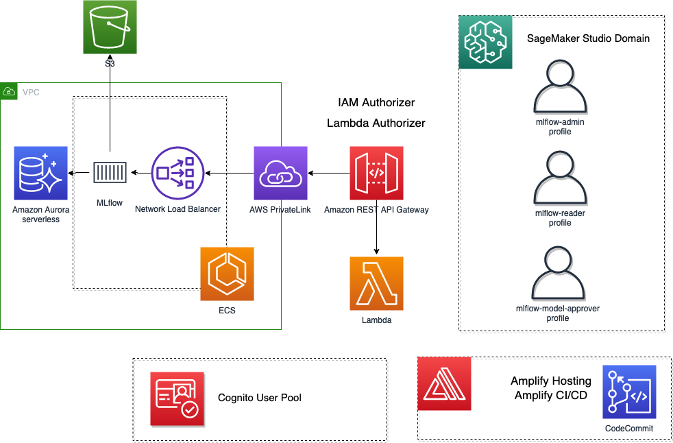
*Fig. 1 - MLflow on AWS architecture diagram*

## Prerequisites
* Access to an AWS account with Admin permissions and credentials correctly set
* Docker
* Python 3.8

## Deployment

### Create and configure AWS Cloud9 environment

Log into the AWS Management Console and search for [Cloud9](https://aws.amazon.com/cloud9/) in the search bar.
Click Cloud9 and create an AWS Cloud9 environment region based on Amazon Linux 2.
For the instance type, we tested with a `t3.large`, but you can very likely use a Free-Tier eligible instance.

### Provisioning AWS resources using the AWS CDK

#### Clone the GitHub repository

Open a new terminal inside AWS Cloud9 IDE and run:
```bash
git clone https://github.com/aws-samples/sagemaker-studio-mlflow-integration.git
```

#### Setting the expected ENV variables

The CDK script expects the following ENV variables to be set

```bash
AWS_REGION=<region-where-you-want-to-deploy>
AWS_ACCOUNT=<AWS-account-where-you-want-to-deploy>
```

If you would like to use an existing SageMaker Studio domain, please set this ENV variable

```bash
DOMAIN_ID=<your-existing-sagemaker-studio-domain-id>
```

The default region used by the CDK app is `us-west-2`.
You can change the default region by setting up the `AWS_REGION` environment variable.
When working on Cloud9, you can specify the same region where your Cloud9 environment is running as follow:

```bash
sudo yum install jq -y
export AWS_REGION=$(curl -s 169.254.169.254/latest/dynamic/instance-identity/document | jq -r '.region')
echo "export AWS_REGION=${AWS_REGION}" | tee -a ~/.bash_profile
export AWS_ACCOUNT=$(aws sts get-caller-identity --query Account --output text)
echo "export AWS_ACCOUNT=${AWS_ACCOUNT}" | tee -a ~/.bash_profile
```

The CDK script expects to find the ENV variable `DOMAIN_ID` in order to figure out if a new SageMaker Studio domain is needed or not.
```bash
export DOMAIN_ID=$(aws sagemaker list-domains | jq -r 'select(.Domains[0] != null) .Domains[0].DomainId | tostring')
echo "export DOMAIN_ID=${DOMAIN_ID}" | tee -a ~/.bash_profile
```

#### Apply patch to MLflow-UI

MLflow UI does not support any login workflow, nonetheless mechanisms to set the proper headers to authenticated API calls against a backend service.
Amplify provides libraries that can be used to quickly add a login workflow, and to easily manage the lifecycle of the authentication tokens.
We provide you a patch to be applied on top of MLflow `2.8.0` that adds Amplify React Components for authentication and how to add `Authorization` header with a `Bearer` token for every backend API call.
The patch we provided can be checked [here](./cognito-mlflow_v2-8-0.patch) and it will enable a login flow backed by Amazon Cognito as shown in Fig. 2.
**Note: we also provide patches for previous versions of MLflow

* `1.30.0`. If you want to install that version, you need to ensure mlflow `1.30.0` [here](./cognito-mlflow_v1-30-0.patch) installed throughout this sample, and you adapt the lab sample to work with that same version as the SDK for deploying a model to SageMaker has changed**
* `2.2.1`. If you want to install that version, you need to ensure mlflow `2.2.1` [here](./cognito-mlflow_v2-2-1.patch) installed throughout this sample, and you adapt the lab sample to work with that same version as the SDK for deploying a model to SageMaker has changed**
* `2.3.1`. If you want to install that version, you need to ensure mlflow `2.3.1` [here](./cognito-mlflow_v2-3-1.patch) installed throughout this sample, and you adapt the lab sample to work with that same version as the SDK for deploying a model to SageMaker has changed**
* `2.5.0`. If you want to install that version, you need to ensure mlflow `2.5.0` [here](./cognito-mlflow_v2-5-0.patch) installed throughout this sample, and you adapt the lab sample to work with that same version as the SDK for deploying a model to SageMaker has changed**

```bash
cd ~/environment/sagemaker-studio-mlflow-integration/
git clone --depth 1 --branch v2.8.0 https://github.com/mlflow/mlflow.git
cd mlflow
git am ../cognito-mlflow_v2-8-0.patch
```

#### Resizing the Cloud9
Before deploying, since we use CDK construct to build the container images locally, we need a larger disk size than the one provided by Cloud9 in its default environment configuration (i.e. 20GB, whivh is not enough).
To resize it on the fly without rebooting the instance, you can run the following script specifying a new desired size.

```bash
cd ~/environment/sagemaker-studio-mlflow-integration/
./resize-cloud9.sh 100
```
Where `100` represents the new desired disk size in GB.

#### Install and bootstrap AWS CDK

The AWS Cloud Development Kit (AWS CDK) is an open-source software development framework to model and provision your cloud application resources using familiar programming languages.
If you would like to familiarize yourself the [CDKWorkshop](https://cdkworkshop.com/) is a great place to start.

Using Cloud9 environment, open a new Terminal and use the following commands:
```bash
cd ~/environment/sagemaker-studio-mlflow-integration/cdk
npm install -g aws-cdk@2.104.0 --force
cdk --version
```

Take a note of the latest version that you install, at the time of writing this post it is `2.104.0`.
Open the package.json file and replace the version “2.104.0” of the following modules with the latest version that you have installed above.

```typescript
"aws-cdk-lib": "2.104.0",
"@aws-cdk/aws-amplify-alpha": "2.104.0-alpha.0",
"@aws-cdk/aws-cognito-identitypool-alpha": "2.104.0-alpha.0",
"@aws-cdk/aws-lambda-python-alpha": "2.104.0-alpha.0",
```

This will install all the latest CDK modules under the `node_modules` directory (`npm install`) and prepare your AWS account to deploy resources with CDK (`cdk bootstrap`).

```bash
cd ~/environment/sagemaker-studio-mlflow-integration/cdk
npm install
cdk bootstrap
```

## Provisioning AWS resources using AWS CDK

Now we are ready to deploy our full solution.
```bash
cdk deploy --all --require-approval never
```

To run this sample, we reccommend to deploy all 4 Stacks to test out the SageMaker integration.
However, if you are only interested in the MLflow deployment (MLflow server, MLflow UI, and REST API Gateway), you can deploy only the first three stacks, i.e. [`MLflowVPCStack`](./cdk/lib/mlflow-vpc-stack.ts), [`RestApiGatewayStack`](./cdk/lib/rest-api-gateway-stack.ts) and [`AmplifyMLflowStack`](./cdk/lib/amplify-mlflow-stack.ts).

## Cognito User Pool and Lambda Authorizer

We have provided a script that will populate the Cognito User Pool with 3 users, each belonging to a different group.
To execute the script, please run the following command.
The script will prompt you to enter your desired password.
Please ensure that the password you pick respects the password policy defined for [Cognito](https://github.com/aws-samples/sagemaker-studio-mlflow-integration/blob/449d5557ee6edeb4c7f17ce5f2dfa310e5684ee6/cdk/lib/rest-api-gateway-stack.ts#L40)

```bash
cd ~/environment/sagemaker-studio-mlflow-integration/src/cognito/
python add_users_and_groups.py
```
To check the script code [here](./src/cognito/add_users_and_groups.py).

After running the script, if you check the Cognito User Pool in the console you should see the three users created


*Fig. 2 - Cognito users in the Cognito User Pool.*

On the REST API Gateway side, the Lambda Authorizer will first verify the signature of the token using the Cognito User Pool Key, verify the claims, and only after that, it will extract the cognito group the user belongs to from the claim in JWT token (i.e., `cognito:groups`), and apply different permissions based on the group itself that we have programmed.
For our specific case, we have three groups:
* `admins` - can see and can edit everything
* `readers` - can only read everything
* `model-approvers` - same as `readers` plus permissions to register models, create model versions, and update models to different stages.

Depending on the group, the Lambda Authorizer will generate different IAM Policies.
This is just an example on how authorization can be achieved, in fact, with a Lambda Authorizer, you can implement any logic you want.
If you want to restrict only a subset of actions, you need to be aware of the MLFlow REST API definition, which can be found [here](https://www.mlflow.org/docs/latest/rest-api.html)
The code for the Lambda Authorizer can be explored [here](./cdk/lambda/authorizer/index.py)

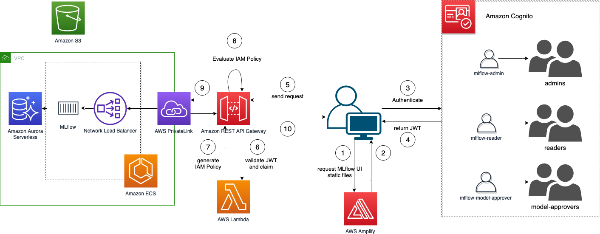
*Fig. 3 - MLflow login flow using AWS Amplify, Amazon Cognito and Lambda Authorizer on the API Gateway*

## *Integration with SageMaker*

One of the key aspect of this sample, is the integration with SageMaker.
Permissions in SageMaker are managed via IAM Roles, for SageMaker also called Execution Roles that are associated to the service when in use (both when using SageMaker Studio, or the SageMaker managed infrastructure).
By allowing the API Gateway to use IAM authentication on the `<MLFLOW-Tracking-URL>/api/`, we can do exatly that.

### Provision a new SageMaker Studio domain

Provisioning a new SageMaker Studio domain will do the following operations:

* Create a new SageMaker Studio domain in the default VPC. (unless already existing)
* Create three new SageMaker Studio users attached to the domain and three different execution role created attached to them. These execution role the same permissions that the Lambda Authorizer applies to the different groups.
  * `mlflow-admin` - has associated an execution role with the similar permissions as the user in the cognito group `admins` 
  * `mlflow-reader` - has associated an execution role with the similar permissions as the user in the cognito group `readers`
  * `mlflow-model-arrpover` - has associated an execution role with the similar permissions as the user in the cognito group `deny-all`

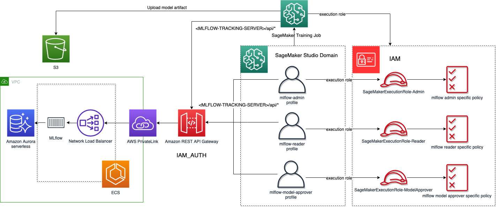
*Fig. 3 - Accessing MLflow from SageMaker Studio and SageMaker Training Jobs using IAM Roles*

### Push the `mlflow-pyfunc` container to ECR

#### Ensure Python 3.8 (or greater) is installed

In order to deploy to SageMaker an mlflow model, you need to create a serving container that implements what the SageMaker runtime expects to find.
MLflow makes this effor easier by providing a CLI command that build the image locally and pushes to your ECR the image.
Most recent versions of MLflow have dependencies on `Python 3.8`.

```bash
python --version
```

If running this sample on Cloud9, you need to ensure you have Python `3.8` installed.
You can follow these instructions on how to do it
```bash
sudo yum install -y amazon-linux-extras
sudo amazon-linux-extras enable python3.8
sudo yum install -y python3.8
```

#### Push the `mlflow-pyfunc` container to ECR

Il on Cloud9 run the following (after installing Python 3.8)
```bash
# install the libraries
pip3.8 install mlflow==2.8.0 boto3 # or pip install mlflow==2.8.0 boto3 if your default pip comes alongside a python version >= 3.8
```

```bash
# build and push the container to ECR into your account
mlflow sagemaker build-and-push-container
```

### Accessing the MLflow UI
Before accessing the MLflow UI, we need to ensure the first build got successfully executed.
Navigate to the Amplify console, and select the `MLflow-UI` app that we have created.

Once the build completes (might take some time) you can access the MLFlow UI from the link provided by Amplify as shown in Fig. 5.

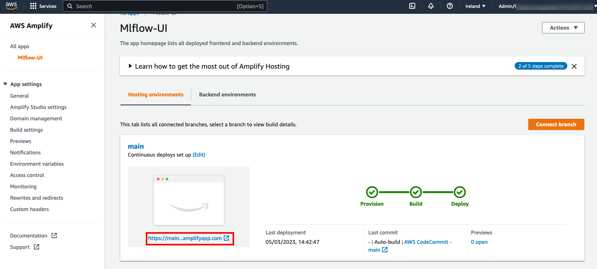
*Fig. 4 - Retrieve the URL of the MLflow UI*

There might be cases when the first Amplify build fails.
If this is not the case, you should re-deploy manually the Amplify build by navigating to the failed build.
You first select the `main` branch

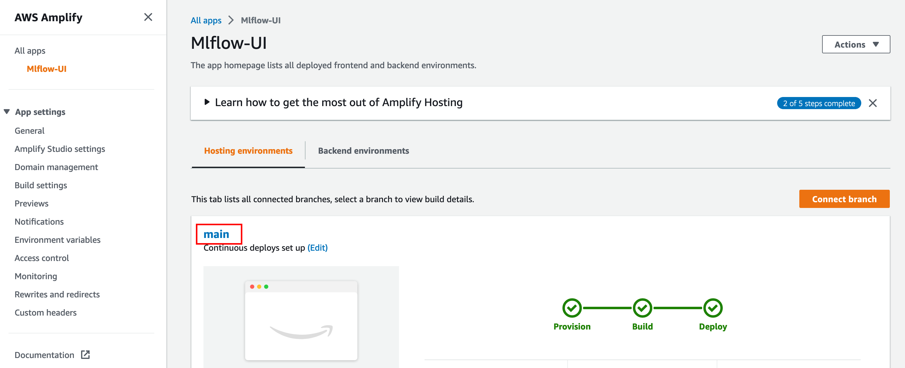
*Fig. 5 - Navigate to the Amplify `main` branch*

and then click on the "Redeploy this version".

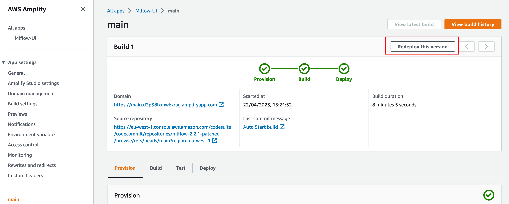
*Fig. 6 - Redeploy the same failed build*

After a few minutes, you should see the successful build.

### MLflow / Amazon SageMaker Studio integration lab

In the AWS console, navigate to Amazon SageMaker Studio and open Studio for the `mlflow-admin` user as shown in the pictures below.

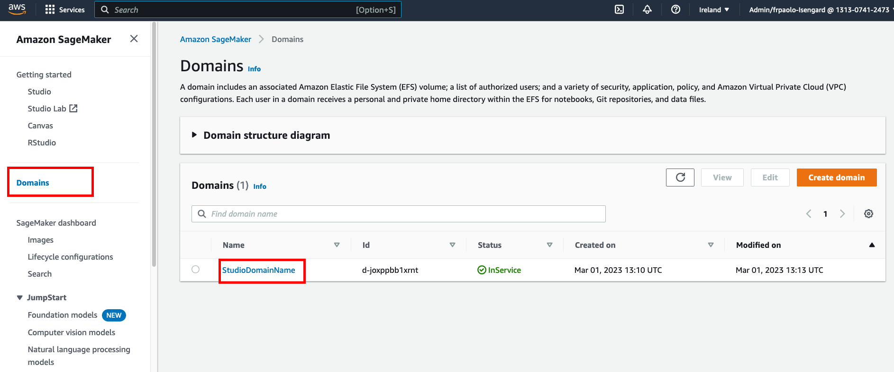
*Fig 6 - Navigate to Amazon SageMaker Studio*

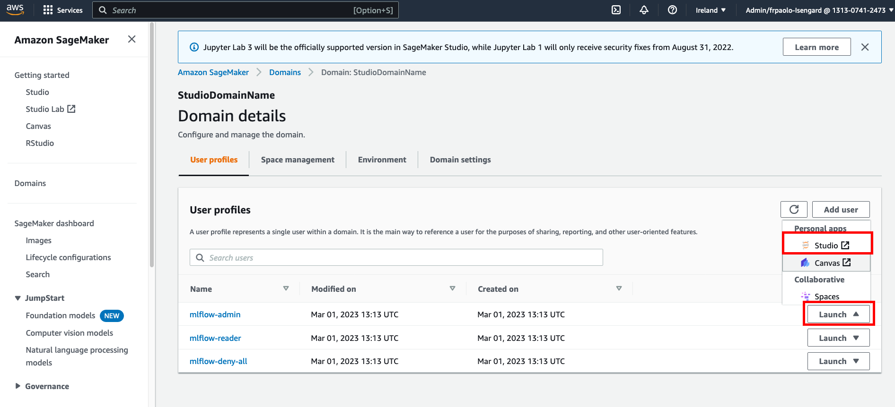
*Fig 7 - Launch Amazon SageMaker Studio for the `mlflow-admin`*

Clone this repository either from the terminal or from the SageMaker Studio UI.

```bash
git clone https://github.com/aws-samples/sagemaker-studio-mlflow-integration.git
```

## Labs
We provide three labs located in the `./sagemaker-studio-mlflow-integration/lab/` folder.
When running the labs, please make sure the kernel selected is `Base Python 2.0` (it should be selected by default).
1. [`1_mlflow-admin-lab.ipynb`](./lab/1_mlflow-admin-lab.ipybn) For this lab, please use the `mlflow-admin` user profile created for you in SageMaker Studio. In this lab you will test an admin permission. In here we access MLflow from both SageMaker Studio, and from a SageMaker Training Job using the execution role assigned to the user profile `mlflow-admin`. Once the training is completed, we further show how to register models, create model versions from the artifact, and download locally the artifacts for testing purposes. Finally, we show how to deploy the model on the SageMaker Managed infrastructure. Furthermore, the lab shows how you can enrich MLflow metadata with SageMaker metadata, and vice versa, by storing MFlow specifics in SageMaker via SageMaker Experiments SDK and visualize them in the SageMaker Studio UI.
2. [`2_mlflow-reader-lab.ipynb`](./lab/2_mlflow-reader-lab.ipybn) For this lab, please use the `mlflow-reader` user profile created for you in SageMaker Studio. In this lab you will test read like permissions. You can see details about every experiment, every run, as well as registered models and model versions, however you cannot modify / create new entities.
3. [`3_mlflow-model-approver-lab.ipynb`](./lab/3_mlflow-model-approver-lab.ipybn) For this lab, please use the `mlflow-model-approver` user profile created for you in SageMaker Studio. In this lab you will test the permissions to register new models and new model versions.

## Render MLflow within SageMaker Studio

SageMaker Studio is based upon Jupyter Lab, and it offers the same flexibility to extend its capabilities thanks for jupyter extensions.
You have the possibility to build your own extension, or to access one of the existing one via the "Extension Manager" (see Fig. 9).

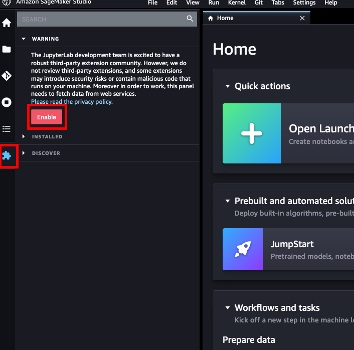

*Fig. 9 - Enable Extension Manager in SageMaker Studio*

For our excercise, the [`jupyterlab-iframe`](https://pypi.org/project/jupyterlab-iframe/) extension provides us the capability to render websites within an iframe.
To install, you can either follow the instructions in the extension documentation, or install it via the Extension Manager.

Once successfully installed, from the SageMaker Studio menu, `View`->`Activate Command Palette` dialog, search for "iframe" as in figure

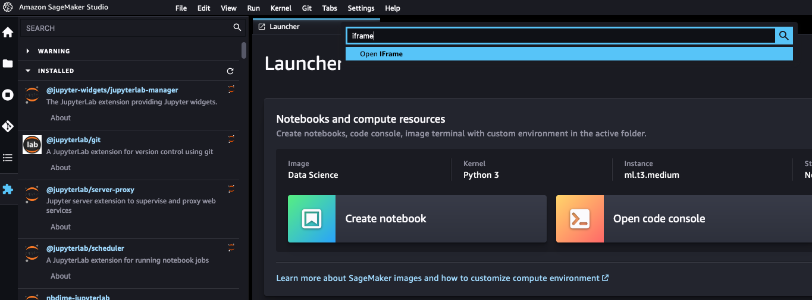

*Fig. 10 - Open the jupyterlab-iframe dialog*

Finally, set the MLflow UI URL generated by Amplify and open the tab.
You can now access MLflow UI without leaving the SageMaker Studio UI using the same set of credentials you have stored in Amazon Cognito as shown in Fig. 11

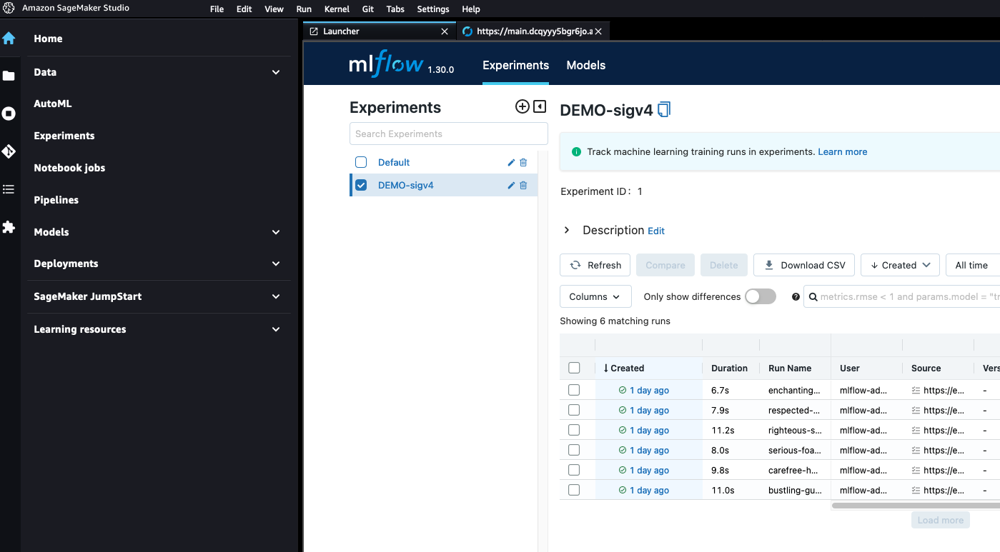

*Fig. 11 - Access MLflow UI from within SageMaker Studio*

## Cleanup

You can destroy the CDK stack by running the following command:

```bash
cd ~/environment/aws-mlflow-sagemaker-cdk/cdk
cdk destroy --all
```

At the prompt, enter `y`.

There might be cases when the cleanup might not work.
Usually, this is due to the creation of different SageMaker Studio KernelApps than the ones have been provisioned by the CDK stack.
In this case, you should first delete all `KernelApp` on all user profiles manually, and then try again to destroy the stack as explained earlier.

Cost of just running this sample: < 10$.
The biggest cost driver in this sample are the 3 `KernelGateway` apps initialized for the SageMaker Studio Domain.
To save costs, you can delete the 3 `KernelGateway` apps, one for each user profile, that spins up a `ml.t3.medium` instance type each.
They can be deleted from the console, and they are named as `instance-mlflow-basepython-2-0-ml-t3-medium`.
Alternatively, you could install the [sagemaker-studio-auto-shutdown-extension](https://github.com/aws-samples/sagemaker-studio-auto-shutdown-extension) to save on costs.

## Conclusion

We have shown how you can add authentication and authorization to a single tenent MLflow serverless installation with minimal code changes to MLflow.
The highlight of this exercise is the authentication to an MLflow tracking server via IAM Roles within SageMaker, leveraging the security the IAM carries with it.
