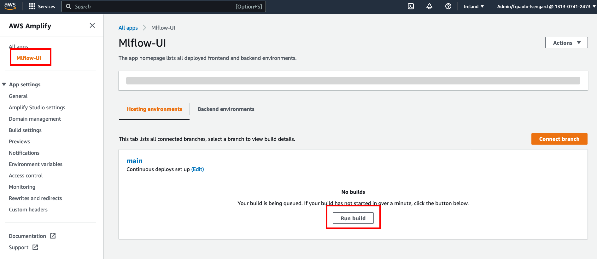
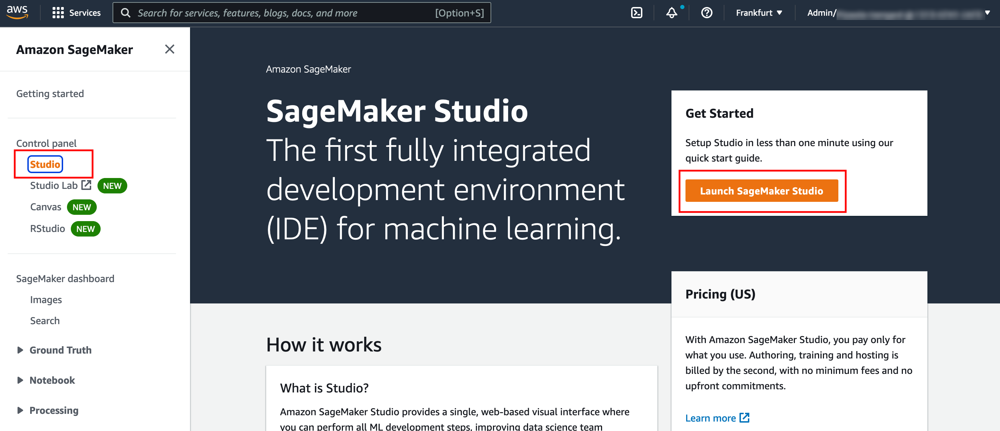
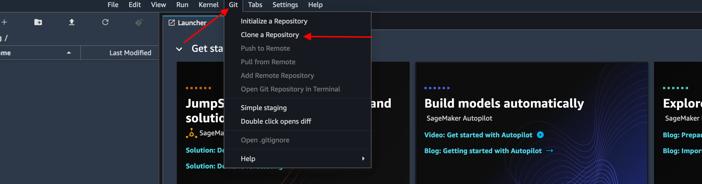
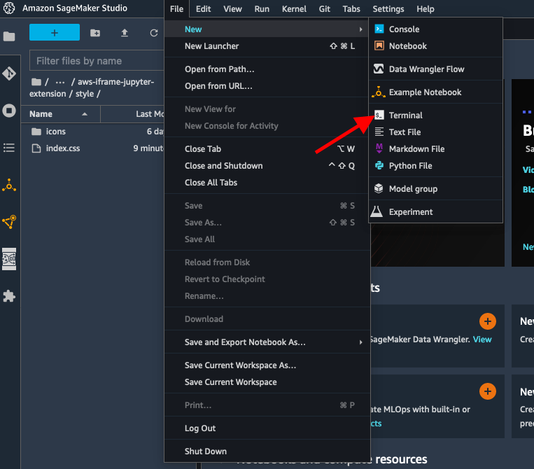

# Secure MLflow in AWS with native AWS services

## Custom authentication and authorization on MLflow

This sample shows how to do the following:

* How to deploy MLflow on a serverless architecture (we build on top of [running MLflow on Fargate](https://github.com/aws-samples/amazon-sagemaker-mlflow-fargate))
* How to expose a MLflow server via private integrations to an Amazon API Gateway (we build on top of [running MLflow on AWS](https://github.com/aws-samples/aws-mlflow-sagemaker-cdk))
* How to add authentication and authorization for programmatic access and browser access to MLflow
* How to access MLflow via SageMaker using SageMaker Execution Roles

Due to its modularity, this sample can be extended in a number of ways, and we will provide guidance on how to do so.


## Architecture

This sample is made of 4 different stacks:
* [`MLflowVPCStack`](https://github.com/aws-samples/sagemaker-studio-mlflow-integration/blob/main/cdk/lib/mlflow-vpc-stack.ts)
    * deploys a MLfLow tracking server on a serverless infrastructure running on ECS and Fargate on a private subnet
    * deploys an Aurora Serverless database for the data store and S3 for the artifact store.
* [`RestApiGatewayStack`](https://github.com/aws-samples/sagemaker-studio-mlflow-integration/blob/main/cdk/lib/rest-api-gateway-stack.ts)
    * exposes the MLFlow server via a PrivateLink to an REST API Gateway.
    * deploys a Cognito User Pool to manage the users accessing the UI.
    * deploy a Lambda Authorizer to verify the JWT token with the Cognito User Pool ID keys and returns IAM policies to allow or deny a request.
    * adds IAM Authorizer. This will be applied to the 
* [`AmplifyMLflowStack`](https://github.com/aws-samples/sagemaker-studio-mlflow-integration/blob/main/cdk/lib/amplify-mlflow-stack.ts)
    * creates an app with CI/CD capability to deploy the MLFLow UI
* [`SageMakerStudioUserStack`](https://github.com/aws-samples/sagemaker-studio-mlflow-integration/blob/main/cdk/lib/sagemaker-studio-user-stack.ts)
    * deploys a SageMaker Studio domain (if not existing).
    * adds three users, each one with a different SageMaker execution role implementing different access level:
        * `mlflow-admin` -> admin like permission to the MLFlow resources
        * `mlflow-reader` -> read-only admin to the MLFlow resources
        * `mlflow-deny-all` -> cannot access any MLFlow resource

Our proposed architecture is shown Fig. 1


*Fig. 1 - MLflow on AWS architecture diagram*

## Prerequisites
* access to an AWS account with Admin permissions.

## Deployment

### Create and configure AWS Cloud9 environment

Log into the AWS Management Console and search for [Cloud9](https://aws.amazon.com/cloud9/) in the search bar.
Click Cloud9 and create an AWS Cloud9 environment region based on Amazon Linux 2.
For the instance type, we tested with a `t3.large`, but you can very likely use a Free-Tier eligible instance.

### Provisioning AWS resources using the AWS CDK

#### Clone the GitHub repository

Open a new terminal inside AWS Cloud9 IDE and run:
```bash
git clone https://github.com/aws-samples/sagemaker-studio-mlflow-integration.git
```

#### Setting the expected ENV variables

The default region used by the CDK app is `us-west-2`.
If you are already working in `us-west-2` you can skip this section.
However, you can change the default region by setting up the `AWS_REGION` environment variable.
When working on Cloud9, you can specify the same region where your Cloud9 environment is running as follow:

```bash
sudo yum install jq -y
export AWS_REGION=$(curl -s 169.254.169.254/latest/dynamic/instance-identity/document | jq -r '.region')
echo "export AWS_REGION=${AWS_REGION}" | tee -a ~/.bash_profile
export AWS_ACCOUNT=$(aws sts get-caller-identity --query Account --output text)
echo "export AWS_ACCOUNT=${AWS_ACCOUNT}" | tee -a ~/.bash_profile
```

The CDK script expects to find the ENV variable `DOMAIN_ID` in order to figure out if a new SageMaker Studio domain is needed or not.
```bash
export DOMAIN_ID=$(aws sagemaker list-domains | jq -r 'select(.Domains[0] != null) .Domains[0].DomainId | tostring')
echo "export DOMAIN_ID=${DOMAIN_ID}" | tee -a ~/.bash_profile
```

#### Apply patch to MLflow-UI

MLflow UI does not support any login workflow, nonetheless mechanisms to set the proper headers to authenticated API calls against a backend service.
Amplify provides libraries that can be used to quickly add a login workflow, and to easily manage the lifecycle of the authentication tokens.
We provide you a patch to be applied on top of MLflow `1.30.0` that adds Amplify React Components for authentication and how to add `Authorization` header with a `Bearer` token for every backend API call.
The patch we provided can be checked [here](https://github.com/aws-samples/sagemaker-studio-mlflow-integration/blob/main/cognito.patch) and it will enable a login flow backed by Amazon Cognito as shown in Fig. 2.

```bash
cd ~/environment/sagemaker-studio-mlflow-integration/
git clone --depth 1 --branch v1.30.0 https://github.com/mlflow/mlflow.git
cd mlflow
git am ../cognito.patch
```


*Fig. 2 - MLflow login flow using AWS Amplify, Amazon Cognito and Lambda Authorizer on the API Gateway*

#### Resizing the Cloud9
Before deploying, since we use CDK construct to build the container images locally, we need a larger disk size than the one provided by Cloud9 in its default environment configuration (i.e. 20GB, whivh is not enough).
To resize it on the fly without rebooting the instance, you can run the following script specifying a new desired size.

```bash
cd ~/environment/sagemaker-studio-mlflow-integration/
./resize-cloud9.sh 100
```
Where `100` represents the new desired disk size in GB.

#### Install and bootstrap AWS CDK

The AWS Cloud Development Kit (AWS CDK) is an open-source software development framework to model and provision your cloud application resources using familiar programming languages.
If you would like to familiarize yourself the [CDKWorkshop](https://cdkworkshop.com/) is a great place to start.

Using Cloud9 environment, open a new Terminal and use the following commands:
```bash
cd ~/environment/sagemaker-studio-mlflow-integration/cdk
npm install -g aws-cdk@2.63.2 --force
cdk --version
```

Take a note of the latest version that you install, at the time of writing this post it is `2.63.2`.
Open the package.json file and replace the version “2.63.2” of the following modules with the latest version that you have installed above.

```typescript
"aws-cdk-lib": "2.63.2",
```

This will install all the latest CDK modules under the `node_modules` directory (`npm install`) and prepare your AWS account to deploy resources with CDK (`cdk bootstrap`).

```bash
cd ~/environment/sagemaker-studio-mlflow-integration/cdk
npm install
cdk bootstrap
```

## Provisioning AWS resources using AWS CDK

Now we are ready to deploy our full solution.
```bash
cdk deploy --all --require-approval never
```

## Cognito User Pool and Lambda Authorizer

We have provided a script that will populate the Cognito User Pool with 3 users, each belonging to a different group.
To execute the script, please run the following command.
The script will prompt you to enter your desired password.
Please ensure that the password you pick respects the password policy defined for [Cognito](https://github.com/aws-samples/sagemaker-studio-mlflow-integration/blob/449d5557ee6edeb4c7f17ce5f2dfa310e5684ee6/cdk/lib/rest-api-gateway-stack.ts#L40)

```bash
cd ~/environment/sagemaker-studio-mlflow-integration/src/cognito/
python add_users_and_groups.py
```
To check the script code [here](https://github.com/aws-samples/sagemaker-studio-mlflow-integration/blob/main/src/cognito/add_users_and_groups.py).

After running the script, if you check the Cognito User Pool in the console you should see the three users created


*Fig. 3 - Cognito users in the Cognito User Pool.*

On the REST API Gateway side, the Lambda Authorizer will first verify the signature of the token using the Cognito User Pool Key, verify the claims, and only after that, it will extract the cognito group the user belongs to from the claim in JWT token (i.e., `cognito:groups`), and apply different permissions based on the group itself that we have programmed.
For our specific case, we have three groups:
* `admins` - can see and can edit everything
* `readers` - can only see everything
* `deny-all` - cannot see / edit anything

Depending on the group, the Lambda Authorizer will generate different IAM Policies.
This is just an example on how authorization can be achieved, in fact, with a Lambda Authorizer, you can implement any logic you want.
If you want to restrict only a subset of actions, you need to be aware of the MLFlow REST API definition, which can be found [here](https://www.mlflow.org/docs/latest/rest-api.html)
The code for the Lambda Authorizer can be explored [here](https://github.com/aws-samples/sagemaker-studio-mlflow-integration/blob/main/cdk/lambda/authorizer/index.py)

## *Integration with SageMaker*

One of the key aspect of this sample, is the integration with SageMaker.
Permissions in SageMaker are managed via IAM Roles, for SageMaker also called Execution Roles that are associated to the service when in use (both when using SageMaker Studio, or the SageMaker managed infrastructure).
By allowing the API Gateway to use IAM authentication on the `<MLFLOW-Tracking-URL>/api/`, we can do exatly that.

### Provision a new SageMaker Studio domain

Provisioning a new SageMaker Studio domain will do the following operations:

* Create a new SageMaker Studio domain in the default VPC. (unless already existing)
* Create three new SageMaker Studio users attached to the domain and three different execution role created attached to them. These execution role the same permissions that the Lambda Authorizer applies to the different groups.
  * `mlflow-admin` - has associated an execution role with the similar permissions as the user in the cognito group `admins` 
  * `mlflow-reader` - has associated an execution role with the similar permissions as the user in the cognito group `readers`
  * `mlflow-deny-all` - has associated an execution role with the similar permissions as the user in the cognito group `deny-all`


*Fig. 3 - Accessing MLflow from SageMeker Studio and SageMaker Training Jobs using IAM Roles*

### Push the `mlflow-pyfunc` container to ECR

In order to deploy to SageMaker an mlflow model, you need to create a serving container that implements what the SageMaker runtime expects to find.
MLFlow makes this effor easier by providing a CLI command that build the image locally and pushes to your ECR the image.

```bash
# install the libraries
pip install mlflow==1.30.0 boto3

# build and push the container to ECR into your account
mlflow sagemaker build-and-push-container
```

### Accessing the MLFlow UI
Before accessing the MLFlow UI, we need to ensure the the first build got executed.
Navigate to the Amplify console, and select the `MLFlow-UI` app that we have created.
Then execute the first build as shown in Fig. 4.


*Fig. 4 - Execute the first build for the MLFlow UI*

Once the build completes (might take some time) you can access the MLFlow UI from the link provided by Amplify as shown in Fig. 5.


*Fig. 5 - Retrieve the URL of the MLFlow UI*

### MLFlow / Amazon SageMaker Studio integration lab

In the AWS console, navigate to Amazon SageMaker Studio and open Studio for the `mlflow-admin` user as shown in the pictures below.


*Fig 6 - Navigate to Amazon SageMaker Studio*


*Fig 7 - Launch Amazon SageMaker Studio for the `mlflow-admin`*

Clone this repository either from the terminal or from the Studio UI.


*Fig 8 - Clone repo in SageMaker Studio*

Navigate to the `./sagemaker-studio-mlflow-integration/lab/` folder and open the open the `sagemaker_studio_and_mlflow.ipynb` notebook.
You can see how to train in Amazon SageMaker and store the resulting models in MLFlow after retrieving the credentials at runtime and how to deploy models stored in Amazon SageMaker endpoints using the MLFlow SDK.
Furthermore, the lab shows how you can enrich MLFlow metadata with SageMaker metadata, and vice versa, by storing MFlow specifics in SageMaker via SageMaker Experiments SDK and visualize them in the SageMaker Studio UI.

## Load MLFlow within SageMaker Studio in an iframe

This is an extension for Jupyter Lab that allows you to load any webpage as an iframe resources in-context of your existing SageMaker Studio environment. 

### Prerequisites

1. node version > 14.x
1. jupyter lab version 3.x (make sure SageMaker Studio Jupyter deploys the version 3 - if you have deployed the SageMaker Studio via the CDK in this repo, everything is fine)

Go to `src/domain.json` and replace the domain of your MLflow UI.
If you have deployed MLflow following this guide, you can use the code snippet below to ease the string replacement from a new terminal window in SageMaker Studio.

```bash
cd /home/sagemaker-user/sagemaker-studio-mlflow-integration/aws-iframe-jupyter-extension/
export APP_ID=$(aws amplify list-apps --query 'apps[?name==`Mlflow-UI`].appId' --output text)
sed -i "s/<YOUR-AMPLIFY-APP-ID>/$APP_ID/" src/domain.json
```

### Build and install instructions
Open a new Terminal from SageMaker Studio as shown in Fig. 8


*Fig. 9 - Open a new Terminal in SageMaker Studio*


* Initialize conda: `conda init` (you might need to restart the terminal)
* Activate the conda studio environment: `conda activate studio`
* Navigate to the `aws-iframe-jupyter-extension` folder
* Install npm dependencies: `npm install`
* Build the extension: `npm run build`
* Install python dependencies: `pip install ./`
* Install the extension: `jupyter labextension install ./`
* Build jupyter lab assets: `jupyter lab build`
* Deactivate the conda studio environment: `conda deactivate`
* Restart the jupyter server: `restart-jupyter-server` (you might need to refresh the whole page)

Code snipped you can copy/paste:
```bash
conda activate studio
cd /home/sagemaker-user/sagemaker-studio-mlflow-integration/aws-iframe-jupyter-extension
npm install
npm run build
pip install ./
jupyter labextension install ./
jupyter lab build
conda deactivate
restart-jupyter-server
```

You can now access MLFlow UI without leaving the SageMaker Studio UI using the same set of credentials you have stored in Amazon Cognito as shown in Fig. 9


*Fig. 10 - Access MLFlow UI from within SageMaker Studio*

## Cleanup

Before removing all resources created, you need to make sure that all Apps are deleted from the `mlflow-*` user, i.e. all `KernelGateway` apps, as well as the default `JupyterServer`.

Once done, you can destroy the CDK stack by running

```bash
cd ~/environment/aws-mlflow-sagemaker-cdk/cdk
cdk destroy --all
```

At the prompt, enter `y`.

## Conclusion

We have shown how you can add authentication and authorization to a single tenent MLFlow serverless installation with minimal code changes to MLflow.
The highlight of this exercise is the authentication to an MLflow tracking server via IAM Roles within SageMaker, leveraging the security the IAM carries with it.
